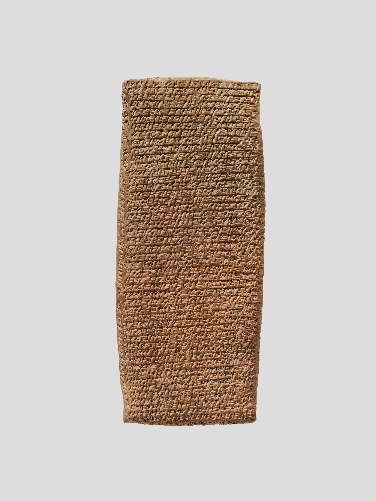
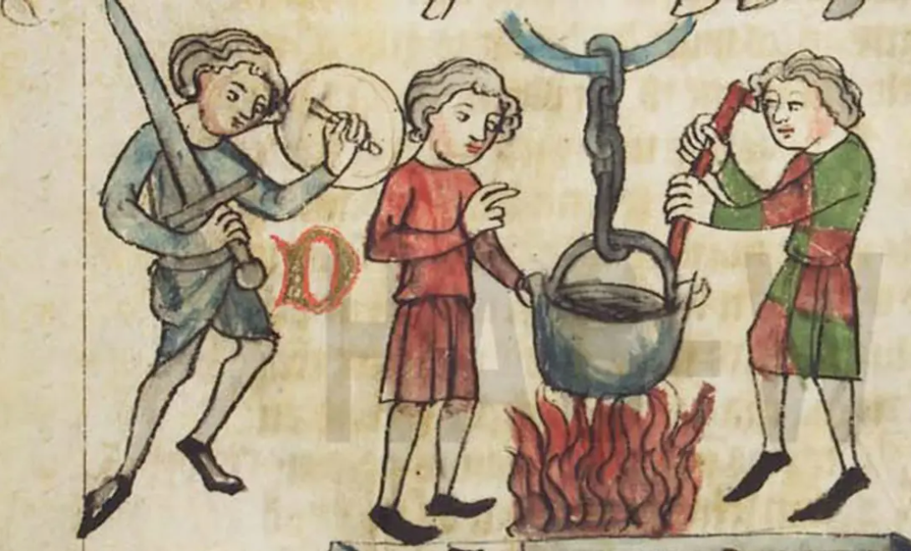

```{r globals, warning=FALSE, message=FALSE, error=FALSE}
source("utils/globals.R")
```

# Definitions

## What are courts?

Mohr defines courts as

> a family of passive governmental institutions one of whose prominent functions is the settlement of disputes, distinguished from other governmental institutions by a commitment to decide impartially, after presentation of proofs and arguments by contending parties, and to be able to justify decisions according to pre-existing rule.[^1]

[^1]: Mohr, Lawrence B. “Organizations, decisions, and courts.” *Law & Society Review* 10, no. 4 (1976): 621-642, p. 623.

## What are courts?

Let's distil the main elements from this definition:

::: incremental
-   "governmental"

-   "institutions" (= organizations)

-   core function = dispute settlement

-   impartiality

-   arbiter between parties

-   justify decisions with pre-existing rules
:::

## What are courts? {.smaller}

-   "**governmental**"

    -   could exclude international courts if understood strictly

    -   seemingly excludes private adjudication and mediation, even if a strong public interest function exists (e.g. Meta Oversight Board)

-   a court is an **organization**

    -   a single individual is not a court; can there be 'judges' without courts? E.g. travelling judges in far-away Roman and Byzantine provinces

    -   organizations have some degree of permanency, physical resources (buildings, staff, etc.), rules of procedure, informal practices

-   a court settles **disputes** between parties, including private and public entities

    -   arbitrators and mediators also resolve disputes, in less rigid settings

## What are courts? {.smaller}

-   courts need to be **impartial** to maintain legitimacy

    -   normative requirement to decide impartially, practical requirement to also *appear* impartial

-   court procedure is principally **adversarial**

    -   the parties present evidence and argue their side of the case; the court decides the case as it is presented to it

-   decisions are motivated with reference to pre-existing rules

    -   laws and precedents should make rulings predictable

    -   need to justify decisions in this way should limit judicial power (discretion)

## Alternative definition

The Court of Justice of the European Union has developed its own definition of a 'court or tribunal':

> \[...\] in order to determine whether a body making a reference is a ‘court or tribunal’ \[...\] the Court takes account of a number of factors, such as, inter alia, whether the body is established by law, whether it is permanent, whether its jurisdiction is compulsory, whether its procedure is inter partes, whether it applies rules of law and whether it is independent \[...\][^2]

[^2]: Case C-132/20 *Getin Noble Bank* \[2022\] ECLI:EU:C:2022:235, para 66.

# Module and assessment

## Module

-   all the information is on the website

    -   <https://michalovadek.github.io/judicial-politics/>

-   lectures + discussion seminars

-   3000-word research paper (100%)

-   think, read, speak (to each other + to me) and write about courts for several hours each week

    -   how do courts relate to your existing interests? geographically, temporally, thematically

## No devices

-   no laptops, tablets or phones in lectures or seminars

-   bad for concentration, yours and that of the people around you

-   bad for retention, as we remember less of what we only half attend to

-   technology and distractions are everywhere, so this gives us two hours a week of protected time and space

-   the only exception is where your SORA requires a device

## Seminars

-   three mandatory readings a week

-   prepare following the instructions on the website

    -   <https://michalovadek.github.io/judicial-politics/seminars.html>

-   bring printed copies of the readings with your own annotations, plus hand-written or printed notes

-   a randomly selected student introduces the readings and kicks off the discussion

    -   your normal discussion notes are enough to do this

## Assessment {.smaller}

-   you should start working on your research paper *right now*

    -   see suggested timeline on the website

-   the assessment is demanding, but the best work will be adequately rewarded

    -   if you do it properly, you will learn a lot

-   previous year:

    -   best mark 80: relevant question, grounded in literature, original data collection, appropriate analytical methods, meticulous attention to detail

    -   worst mark 19: AI slop, vague research question, poor theory, poor methods, undocumented analysis

## Assessment

-   research-oriented =\> suitable for expanding into your dissertation

-   no restrictions on geographical or temporal focus

    -   but generally a good idea to venture into under-researched jurisdictions

-   coming up with something original requires first learning about what is already out there

|            |            | Data       |         |
|------------|------------|------------|---------|
|            |            | *Existing* | *Novel* |
| **Theory** | *Existing* | Nope       | Good    |
|            | *Novel*    | Good       | Okay    |

# Brief history of courts

## Brief history of courts {.smaller}

-   the behaviour of a third-party arbiter mediating disputes long pre-dates the invention of syntactic language (\~ 70 000 BCE) and has been also observed among non-human primates[^3]

-   it is a type of pro-social behaviour which can arise from a concern for the community or as a non-violent avenue to power

-   the development of religious practices and the role of priests were among the earliest forms of 'law' (at first purely oral/physical) and 'judges', possibly as early as 50 000 BCE

## Brief history of courts {.smaller}

-   in early societies a key concern was the regulation of retaliation[^4]

    -   submission to arbitration or a community "judge" requires coordination

    -   risk of blood-feud spirals at family level

    -   similarities with 20th century international law (state retaliation)

-   emergence of institutionalized retribution

    -   most famously in the Babylonian Code of Hammurabi ("eye for an eye")

[^3]: Von Rohr, Claudia Rudolf, Sonja E. Koski, Judith M. Burkart, Clare Caws, Orlaith N. Fraser, Angela Ziltener, and Carel P. Van Schaik. "Impartial third-party interventions in captive chimpanzees: a reflection of community concern." PloS one 7, no. 3 (2012): e32494.

[^4]: Wolff, Hans Julius. "The origin of judicial litigation among the Greeks." *Traditio* (1946): 31-87.

## Brief history of courts

-   the creation of codified laws meant that sophisticated judicial institutions were in place in Mesopotamia at least as early as 2100 BCE

    -   multiple jurisdictions, professional judges only one kind of judges

    -   widespread use of arbitration (private justice institutions) limited recourse to court litigation

    -   public trials (criminal and civil) with evidence, witnesses and adversarial parties, some supernatural elements

## Lawsuit in 19th century BCE

{width="80%"}

## Ancient Greece

-   coexistence of voluntary private arbitration and emergence of compulsory *polis* jurisdiction

-   court jurisdiction was to some extent separate from enforcement (public justice, private enforcement)

    -   a judgment could for example certify one party's right of retribution (e.g. enslavement of the offender)

    -   judgments were frequently difficult to enforce as a result, but NB the social function of trials

::: notes
Mostly drawing on Wolff (1946) who makes the point that Greek courts were merely settling disputes but not ordering litigants to do anything. Litigants would request the court to certify their private enforcement action (self-help).
:::

## Ancient Greece {.smaller}

-   the most important disputes were litigated as public trials before a significant number (100s to 1000s) of jurors, but geographical and temporal variation

-   written laws were generally sparser and more vague than in the Roman world

-   a notable element of ancient Greek judiciary is the absence of a professional legal class

    -   litigants largely represented themselves before lay jurors who also decided the dispute (but they could hire speechwriters)

    -   rhetorical skills were nonetheless a central element of the trial

::: notes
This is a great source: https://www.unpredictableblog.com/blog/Athens Also: https://acoup.blog/2023/04/07/collections-how-to-polis-101-part-iic-the-courts/

Greek jurors were very independent from the "government", but the government itself was mostly weak because direct democracy with elected officials for everything every year
:::

## "Supreme Court" of Ancient Athens {.smaller}

-   Heliaia, founded in the middle of the 500s BCE

-   at its largest consisted of 6001 members chosen annually by lot from men over 30

-   public, transparent gatherings where oral arguments were presented and informally discussed

-   at the end of the trial, jurors[^5] cast their ballot regarding the decision which was by majority

-   magistrates handled the administration of the procedure (e.g. court calendar), but also decided minor (and homicide) cases in smaller courts

[^5]: *The Wasps* by Aristophanes is a Greek play about an old man who is addicted to jury service.

::: notes
Most of our knowledge of ancient Greek judiciary comes from Athens starting in about 600 BCE. From the time of Pericles (5th century BCE), jurors were paid for service. The trial of Socrates (399 BCE) is the famous example: The Death of Socrates by Jacques-Louis David (1787) is in img/socrates-death.jpg if wanted.
:::

## Ancient Rome {.smaller}

-   during the Roman Kingdom era (753-509 BCE), the king had absolute power and was thus the ultimate judge

-   proliferation of Roman law (public and private) from about 300 BCE in response to territorial and economic growth

-   magistrates (public officials) organized the first (pre-trial) stage of a trial

    -   plaintiffs would come to them to request a remedy for a perceived infringement

    -   defendants needed to consent to the litigation (but could be compelled)

    -   the magistrate would describe the action and pass it onto the judge

    -   the judge(s) was jointly agreed on by the parties

-   lay judges heard witnesses and made decisions in public

-   a powerful class of *jurists* -- law experts -- advised on what (they argued) the law was and *advocates* who argued on behalf of their clients

## Quick overview

|              | Greece       | Rome    | Modern  |
|--------------|--------------|---------|---------|
| *Judges*     | ❌           | ✅      | ✅✅✅  |
| *Juries*     | ✅✅         | ✅      | ✅      |
| *Appeals*    | ❌           | ❌      | ✅      |
| *Lawyers*    | ❌           | ✅      | ✅✅    |
| *Oratory*    | ✅✅         | ✅      | ✅      |
| *Form*       | Oral         | Oral    | Written |
| *Precedents* | Very limited | Limited | Common  |

## Pre-modern "trials" {.smaller}

-   there were decidedly pre-modern types of "trial" in the Middle Ages and before, typically mixing law, courts and religious beliefs

    -   **trial by oath**: defendants could establish their innocence by taking an oath and getting a required number of people (often 12 in Europe, up to 50 in early Islamic law) to swear they believed the oath. Found in some countries as late as the 19th century

    -   **trial by ordeal**: the accused was subjected to an (extremely) unpleasant experience to establish their innocence/guilt, most commonly by fire (walking on red-hot metal) or water (retrieving an item from boiling water). Abolished in England after 1219

    -   **trial by combat**: the winner of the fight was presumed to be legally "right"

-   [Peter Leeson makes the argument](https://aeon.co/ideas/why-the-trial-by-ordeal-was-actually-an-effective-test-of-guilt) that ordeals were actually effective judicial tools

::: notes
the guilty knew they would not pass the ordeal -\> admitted guilt

the innocent expected God to intervene (eg not be burned by boiling water) -\> took the ordeal

the ordeal was gamed by priests, so that many of those taking it would pass. The issue with the argument is that the priest was the de facto judge by choosing whether to make water hot or cold and subsequently evaluating the injury
:::

## Trial by boiling water



## Emergence of common law in England {.smaller}

-   body of law developed by judges through precedent (case law)

-   in the 1150s, Henry II (King of England) began sending judges from the royal court in London to the rest of the country to decide disputes

-   over time, the judges built up a corpus of decisions which they perceived as binding (*precedent*) when a similar factual situation arose in a new case

-   this "common" law gradually replaced divergent local laws and customs throughout the kingdom, and originally served by far the most the interests of the king

-   it **empowered judges**, who could invoke the king's authority, to an unprecedented degree

-   the rule of binding precedent solidified the sense of judges' belonging to a **distinct and autonomous professional class** (though guarantees of judicial independence were lacking until 1701)

## Civil law systems

-   legal systems emerging from the idea of the primacy of codified written rules, notably the civil code

-   much of European (and beyond) law has its roots in the *Corpus Juris Civilis* (534 CE, aka Code of Justinian) and in the related *Napoleonic Code* (1804)

-   no binding precedent and judge-made principles – the judge as "the mouthpiece of the law" (Montesquieu)

## Modern courts {.smaller}

-   considerable convergence between civil and common law traditions over the last two centuries

    -   even if not formally binding, civil law judges aim for consistency with previous decisions which are often de facto treated as precedents

    -   statutory law made by parliaments is nowadays the most important source of new rules in common law countries and feature heavily in judicial decisions

-   the principle of **judicial independence** as the cornerstone of the modern judiciary; variation in the prevalence of juries and **judicial review**

-   the court system in democratic regimes is seen as central to upholding **the rule of law**

    -   vertical disputes between the state and individuals (e.g. administrative law) and horizontal disputes between individuals (e.g. contract law)

    -   should ensure respect for the **constitution**, whatever form the latter might take, as well as individual's **fundamental rights**

# From constitutions to judicial review

## Rise of constitutions

```{r compconst, echo=FALSE, warning=FALSE, error=FALSE}
# CCP file too big to keep
# ccp_raw <- read_csv("lectures/data/ccpcnc_v4_small.csv")

# creates summary
# ccp_year <- ccp_raw |>
#  distinct(country, year, .keep_all = T) |>
#  select(country, year, c_inforce) |>
#  count(year, c_inforce) |>
#  mutate(n_countries = sum(n), .by = year) |>
#  rename(n_const = n) |>
#  filter(c_inforce == 1) |>
#  mutate(prop_const = n_const / n_countries)
#save(ccp_year, file = "lectures/data/ccp_year_summary.RData")

# load
load(file = "data/ccp_year_summary.RData")

# plot
ccp_year |>
  ggplot(aes(x = year)) +
  geom_line(aes(y = prop_const)) +
  geom_col(aes(y = n_countries/2000)) +
  theme_minimal() +
  theme(axis.text = element_text(face = "bold")) +
  labs(x = NULL, y = NULL,
       title = "Proportion of countries with a constitution",
       subtitle = "Histogram of the number of countries at the bottom",
       caption = "Source: Comparative Constitutions Project v4.0")
```

## Judicial review {.smaller}

-   the proliferation of constitutions and rights was accompanied by an expansion in (peak) courts' power through **judicial review**

    -   the idea of distinguishing "higher" rules – historically often tied to religion (natural law) – and "lower" rules dates back to at least ancient Greece

    -   constitutions made natural law into (interpretable, enforceable) positive law

-   this is a core source of political tension under constitutionalism: how can anyone (i.e. a court) but the Hobbesian sovereign decide what is permitted?

-   simply pointing to the law does not suffice – language is full of ambiguities, someone needs to interpret and apply it

::: notes
French judges pre-revolution were big supporters of the ancien regime, which made them particularly disliked by the Enlightened thinkers

In contrast, in England judges were seen as relatively anti-monarchy and many of them would view judge-made common law as more important than statutes and decrees, which was a political problem for the King and the Parliament
:::

## *Marbury vs Madison* (1803) {.smaller}

-   outgoing president John Adams appointed judges days before his term was over

-   the appointment documents were failed to be delivered to half of the judges before the arrival of Thomas Jefferson to the presidency

-   the new Secretary of State, James Madison, was told by Jefferson to not deliver them

-   one of the refused judges, William Marbury, filed a lawsuit in late 1801

-   the Supreme Court established it had the power to invalidate statutes deemed unconstitutional (but also found to have had no jurisdiction to force the government to deliver)

::: notes
The person failing to deliver the commissions in time was John Marshall in the role of Secretary of State. He subsequently became the Chief Justice of the Supreme Court before the end of Adams' term, which enabled him to rule on the case. Unanimous 4-0 decision. Portrait of Marshall (1832) is in img/john-marshall.jpg if wanted.
:::

## *Marbury vs Madison* (1803)

> It is emphatically the province and duty of the judicial department to say what the law is.[^6]

[^6]: *Marbury*, 5 U.S. at 177.

## *Marbury vs Madison* (1803) {.smaller}

-   judicial politics on many fronts

    -   born out of a court packing effort

    -   questionable impartiality of the opinion writer

    -   case re-framed as a question of statutory constitutionality

    -   navigating political conflict (between the Federalists and the Democratic-Republicans) and likelihood of compliance

    -   seeking to strengthen the Court's authority

## Models of judicial review {.smaller}

-   **diffuse** (American): any court can set aside a statute in a concrete case, the peak court has the last word

    -   US (1803), Argentina, Japan, the Nordic countries

-   **centralized** (Kelsenian): a single constitutional court, often reviewing statutes in the abstract on referral by politicians or lower courts

    -   Austria (1920), Germany (1951), Italy (1956), most of post-1989 Europe

-   **weak-form**: courts flag the incompatibility but parliament keeps the last word

    -   UK Human Rights Act 1998 (declarations of incompatibility), Canada's notwithstanding clause, New Zealand

-   who can bring a case differs as much as who decides

# Judicialization of politics

## Judicialization of politics

-   the process of power shifting towards courts (and legal institutions) from other branches of government, especially the legislature

-   courts become an important site for settling issues of public policy

-   political actors and action become constrained by court rulings

-   who should ultimately decide matters of public policy?

## Judicialization

-   three ways courts have become empowered vis-a-vis the legislatures [@ferejohn2002judicializing]:

    1.  creation of **substantive limits** on legislative power
    2.  **policy-making** through litigation and judicial precedent
    3.  the regulation of **political activity** and enforcement of standards

## Judicialization {.smaller}

> There is **hardly any political question in the United States that sooner or later does not turn into a judicial question**. From that, the obligation that the parties find in their daily polemics to borrow ideas and language from the judicial system. Since most public men are or have formerly been jurists, they make the habits and the turn of ideas that belong to jurists pass into the handling of public affairs. The jury ends up by familiarizing all classes with them. Thus, judicial language becomes, in a way, the common language; so **the spirit of the jurist, born inside the schools and courtrooms, spreads little by little beyond their confines**; it infiltrates all of society, so to speak; it descends to the lowest ranks, and the entire people finishes by acquiring a part of the habits and tastes of the magistrate.
>
> Alexis de Tocqueville, *Democracy in America* (1835)

## What courts decide today {.smaller}

1.  **Policy**: e.g. rulings on the "pesification" of the Argentinian economy (2003-4)

2.  **Electoral**: Romania's Constitutional Court annulled the first round of the 2024 presidential election; Kenya's Supreme Court annulled the 2017 election; Brazil's electoral court barred Bolsonaro from office until 2030 (2023)

3.  **Constitutional**: SA CC demanding amendments to the constitution (1996); Israel's Supreme Court struck down the 2023 amendment removing the reasonableness standard (2024)

4.  **Identity**: the Turkish Constitutional Court's party bans (1998-2008); India's Supreme Court on Ayodhya (2019)

5.  **Executives**: South Korea's Constitutional Court upheld the impeachment of President Yoon (2025)

-   none of these courts commands an army or a budget

::: notes
the Turkish court eg banned parties which promised to undermine the secularist tradition

Argentinian SC declared unconstitutional the forced conversion of US dollars to pesos

another example of electoral is Bush v Gore (2000) where 5 judges decided to stop the recount in Florida. The recount could have overturned the result in Gore's favour
:::

# Why courts get power

## Why would anyone empower a court?

-   at the most abstract level the creation and maintenance of a powerful judiciary has been argued to be about **credible commitments**

-   by empowering actors (i.e. courts) outside their direct and immediate control, governments signal willingness to be bound by constitutional rules (e.g. respecting property rights) [@north1989constitutions]

    -   in the international context, governments signal commitment to jointly negotiated rules (e.g. treaties), which new democracies use to **lock in** their preferences against future political alternatives [@moravcsik2000origins]

## Why would anyone empower a court? {.smaller}

| theory | mechanism | who empowers courts | evidence |
|------|------|------|------|
| credible commitment | binding oneself reassures investors and creditors | rulers seeking credit or investment | @north1989constitutions |
| insurance | losing power tomorrow makes courts attractive today | incumbents expecting defeat | @ginsburg2003judicial |
| hegemonic preservation | threatened elites lock in their values | dominant but declining elites | @hirschl2004political |
| lock-in | new democracies tie the hands of future governments | fresh democracies | @moravcsik2000origins |
| diffusion | copying neighbours and models | constitution drafters | this week's reading |
| functionalist | complex governance needs adjudication | nobody in particular | |
| rights revolution | litigants and support structures push from below | civil society | @epp1998rights |
| policy entrenchment | parties insulate policies from elections | governing parties | @gillman2002how |

::: notes
Insurance and hegemonic preservation predict opposite empowerers: those about to lose power vs those still dominant but worried about the future. Ginsburg and Versteeg test several of these against each other; leave the details to the seminar.
:::

## Three puzzles to carry through the module

-   most states had a written constitution long before they had constitutional review, which only became common after 1945 – why the lag?

-   why would incumbents build institutions that constrain them? insurance says the losers do it, hegemonic preservation says the winners do

-   courts have neither sword nor purse, yet they decide elections and impeachments; why does anyone comply?

## References
