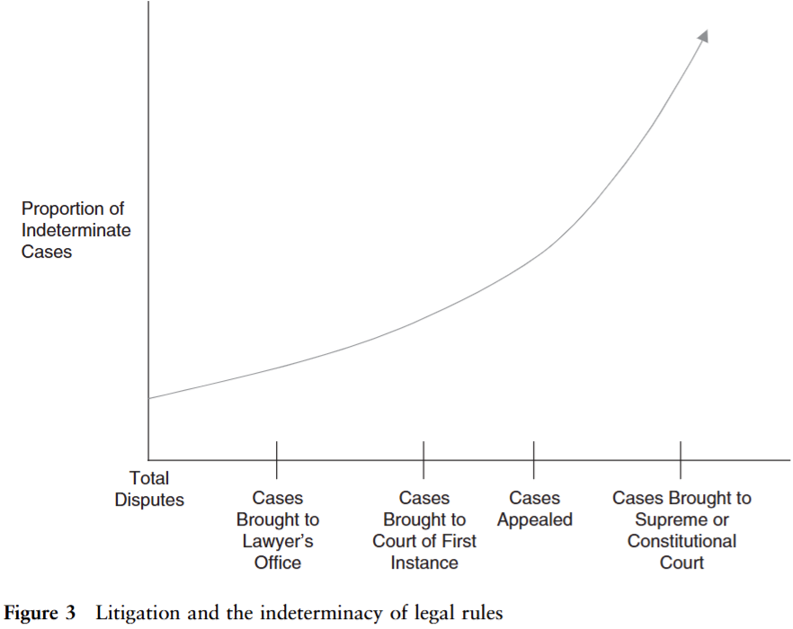
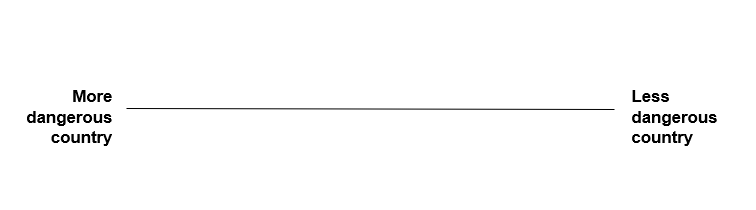
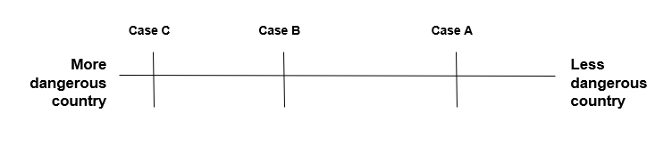
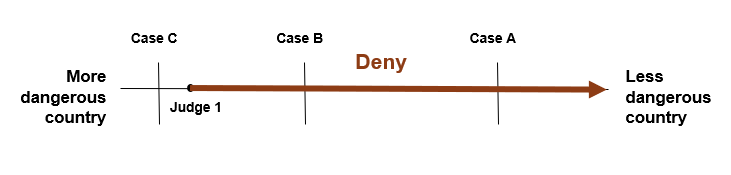
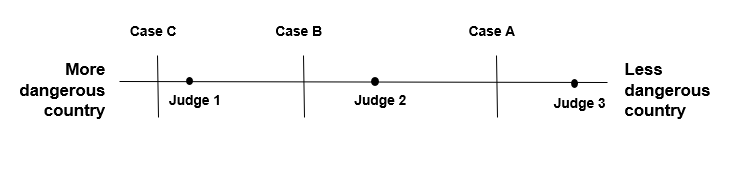

```{r globals, warning=FALSE, message=FALSE, error=FALSE}
source("utils/globals.R")
```

## How do judges make decisions?

-   modern judges are meant to apply legal rules to establish facts and decide disputes about the law
-   in the process of doing so, they are frequently the ultimate authority deciding what the law "is" (and isn't)
-   in this module we will be more concerned with how judges make decisions rather than how they *should* make decisions

## How do judges make decisions?

-   the **legalist** perspective

    $$
        decision = facts \times law
    $$

    -   judges consistently apply legal rules to decide disputes

    -   decisions are only guided by facts and the law

    -   judges assess both facts and the law objectively

    -   the ruling is an honest representation of the judge's views

## Legalism {.smaller}

-   *assumptions* behind the **legalist** perspective

    -   there is one or "best" answer to any legal dispute

    -   legal rules are determinate and contain solutions to problems

    -   judges are capable of identifying the best legal answer to a problem

-   *issues* with the **legalist** perspective

    -   judges have preferences and unconscious biases

    -   there are often many overlapping rules

    -   there are often many possible ways to decide a dispute (discretion)

## Complexity of rules {.smaller}

Let's consider the following simplistic case.

**Law:**

Rule 1: The government can force foreign companies to sell their assets if they threaten national security.

[Rule 2: Companies are free to operate a business in the country.]{style="color:red;"}

[Rule 3: Individuals have a right to express themselves freely.]{style="color:red;"}

**Facts**:

A company based in a rival country wields a lot of influence in the Country. Its service facilitates the freedom of expression of millions of people. It collects data about its users. It does not share the data with the rival government. The Government invokes Rule 1 and orders a sale of the company's assets. The company disputes the legality of the order.

::: notes
Build the slide up in class: start with Rule 1 alone, then add Rule 2, then Rule 3, asking each time how the case should be decided.
:::

## Complexity of rules

-   in a real legal system, there are millions of rules

    -   which subset of them should be applied in a case?

-   the interpretation of both facts and the law entails discretion

## Ambiguity and disputes

```{r ambigsigmoid}
# sigmoidal function
scurve <- function(x){
  y <- exp(x) / (1 + exp(x))
  return(y)
}

# plot
ggplot(data = data.frame(x = c(-4, 4)), aes(x)) +
  geom_rect(xmin = 0, xmax = 4.1, ymin = 0.5, ymax = 1, color = "grey80", fill = "#e3c1d3") +
  stat_function(fun = scurve, n = 100, linewidth = 0.8) +
  theme_arrows() +
  labs(x = "Legal ambiguity", y = "Probability of court involvement",
       title = "Selection effects",
       subtitle = "More ambiguous issues are more likely to make it before courts")
```

## Ambiguity and disputes

-   where the law is perceived as unambiguous, it is less likely that a plaintiff would sue

    -   there will be exceptions, e.g. criminal trials (but settlements)

-   the more ambiguity, the more discretion a judge has in deciding

## Ambiguity and disputes

{width="400"}

## Six paths to a decision {.smaller}

| path | core assumption | best evidence | where it struggles |
|--------------|----------------------------|------------------------------|----------------------------|
| legal | rules and facts decide | unanimity; precedent followed | discretion, ambiguity |
| attitudinal | judges vote their preferences | editorials predict votes | outside SCOTUS |
| strategic | preferences constrained by others | anticipating reversal, override | hard to tell from sincere moderation |
| economic | judges maximize utility, incl. leisure | effort tracks workload and promotion | intrinsic motivation |
| cognitive | judges are boundedly rational | anchoring and framing in experiments | low stakes in the lab |
| identity and socialization | who the judge is shapes decisions | gender, race and training effects | mechanisms rarely observed |

# Attitudinal explanations

## Attitudinal explanations

-   the law alone does not determine case outcomes; judges' attitudinal preferences matter more

-   originally motivated by the study of the US Supreme Court (SCOTUS)

-   judges have political preferences which can be ideological or even partisan

-   judges might seek desired policy outcomes consciously or subconsciously

## Attitudinal explanations

```{r scotusnews}
# data from Epstein et al
usjustices <- read_csv("data/justicesdata2022.csv")

# plot
usjustices |>
  filter(!str_detect(ideo, "^8")) |>
  distinct(name, .keep_all = T) |>
  mutate(ideo = as.numeric(ideo),
         name = str_extract(name, ".*?(?=,)")) |>
  filter(ideo < 1.01) |>
  ggplot(aes(y = ideo, x = yrnom)) +
  geom_text(aes(label = name), alpha = 0.8,
            position = position_jitter(width = 5, height = 0.03)) +
  geom_smooth(fill = "grey80") +
  scale_x_continuous(n.breaks = 10) +
  theme_minimal() +
  theme(
    axis.title.x = element_text(face = "bold"),
  ) +
  labs(x = "Year of nomination", y = "Conservative - Liberal",
       title = "Ideology scores for SCOTUS justices",
       subtitle = "Segal & Cover score of nominee's ideology based on newspaper editorials",
       caption = "Data source: The U.S. Supreme Court Justices Database")
```

## Attitudinal explanations

```{r mquinn}
# data
scotus_mq <- read_csv("data/justices_mquinn.csv")

# plot
scotus_mq |>
  mutate(justice = as.character(justice)) |>
  summarise(mean = mean(post_mn, na.rm = T), .by = c(justiceName, justice)) |>
  left_join(usjustices, by = c("justice"="spaethid")) |>
  mutate(ideo = as.numeric(ideo)) |>
  filter(ideo < 1.01) |>
  ggplot(aes(y = mean, x = 1-ideo)) +
  geom_point() +
  geom_smooth(method = "lm") +
  theme_minimal() +
  labs(y = "Martin-Quinn Score", x = "Segal-Cover Score (reversed)",
       title = "Ideology and voting on SCOTUS",
       subtitle = "The correlation between estimated ideology and voting is ~0.6")
```

## Attitudinal explanations {.smaller}

-   SCOTUS votes can be predicted from newspaper descriptions of the nominees [@segal1989ideological; @cameron2009how]

-   with some exceptions [@weinshallmargel2011attitudinal], partisan identification predicts how judges decide

-   many judicial attitudes map onto a left-right dimension

> "judges’ decisions are a function of what they prefer to do, tempered by what they think they ought to do, but constrained by what they perceive is feasible to do" [@gibson1983simplicity, p. 9]

-   most relevant in "policy" cases

-   preferences are multidimensional: the median justice can vary by issue area [@lauderdale2012supreme]

# Strategic explanations

## Strategic explanations

-   judges want outcomes but depend on others to get them

-   so they vote, write and time decisions with an eye to what others will do

-   attitudinal and strategic models agree that preferences matter, but disagree on whether judges act on them sincerely

-   the constraints come from panels, the judicial hierarchy, the elected branches and the public

# Economic explanations

## Economic explanations

-   judges are **self-interested** agents who want to maximize their utility

-   on the one hand, judges care about reputation, salary, career progress and personal satisfaction

-   on the other hand, judges care about having free time

## Economic explanations

```{r utility1}

# Define utility functions
utility_linear <- function(U, quality) U - quality
utility_cobb_douglas <- function(U, quality) U / sqrt(quality)
utility_perfect_complements <- function(U, quality) pmax(0, U - quality)

# Generate data for utility functions
generate_utility_data <- function(U_levels, quality_vals, utility_func, name) {
  data_list <- lapply(U_levels, function(U) {
    leisure_vals <- utility_func(U, quality_vals)
    data.frame(
      QualityOfWork = quality_vals[leisure_vals >= 0 & !is.infinite(leisure_vals)],
      Leisure = leisure_vals[leisure_vals >= 0 & !is.infinite(leisure_vals)],
      Utility = sprintf("%s (U = %d)", name, U)
    )
  })
  do.call(rbind, data_list)
}

# Parameters
quality_vals <- seq(0, 10, by = 0.1)
U_levels <- c(5, 10, 15)

# Create data for each utility function
data_linear <- generate_utility_data(U_levels, quality_vals, utility_linear, "Linear")
data_cobb <- generate_utility_data(U_levels, quality_vals, utility_cobb_douglas, "Cobb-Douglas")
data_complements <- generate_utility_data(U_levels, quality_vals, utility_perfect_complements, "Perfect Complements")

# Combine all data
data <- rbind(data_cobb, data_linear)

# Plot the utility functions
data |>
  filter(str_detect(Utility, "Cobb")) |>
  ggplot(aes(x = QualityOfWork, y = Leisure, color = Utility)) +
  geom_line(size = 1, show.legend = FALSE) +
  labs(
    title = "Utility functions with diminishing returns",
    subtitle = "Judges with different levels of productivity",
    x = "Quality of Work",
    y = "Leisure Time",
    color = "Utility Function"
  ) +
  scale_color_brewer(palette = "Set2") +
  theme_arrows()
```

::: notes
Judges are willing to substitute quality for leisure time and vice versa. Each curve offers a fixed amount of utility – sliding along the curve is just changing the trade-off. Curve further from the origin means more total utility (= higher productivity). Some judges are more productive than others (as shown in the graph). In reality, some judges value leisure, relative to quality, more than others as well (but this is not very much captured here).
:::

## Economic explanations {.smaller}

-   (peak-court) judges prefer writing better researched rulings over producing more of them [@ash2015intrinsic; @engel2020manna], which is also why they like docket control [@skiple2021how]

-   judges have strong intrinsic motivation to perform well, which reduces the effectiveness of extrinsic measures [@ash2015intrinsic; @engel2017you]

-   making leisure time more attractive (e.g. basketball tournament) makes judges do less and worse work [@clark2018estimating]

-   promotion prospects motivate judges to avoid having their decisions overturned on appeal [@salzberger1999judicial] and to be deferential towards the government or politically popular causes [@sisk1998charting; @ramseyer2001why]

# Cognitive explanations

## Cognitive explanations

-   less fully formed theories of decision-making and more studies of various types of cognitive 'biases'

-   people are only boundedly rational and instead of conducting strictly rational calculations rely on (biased) heuristics

-   there are a number of common cognitive heuristics, e.g. anchoring, framing, hindsight bias, which have been shown to affect judges [@guthrie2001inside; @guthrie2002judging]

## Cognitive explanations {.smaller}

**Anchoring**: an initial value influences one's perception of a reasonable estimate of a value.

-   @guthrie2001inside ask judges to award damages in a personal injury case – those exposed to an irrelevant low number awarded 30% less in damages on average

-   "municipal court judges fined a nightclub three times as much when its name (after its street address) was Club 11,866 rather than Club 58" [@rachlinski2017judging]

-   German judges who rolled dice before sentencing recommended longer sentences after a high roll [@englich2006playing]

## Cognitive explanations {.smaller}

**Framing**: categorization of decision options as more or less positive. Most people are risk-averse when looking at potential gains and risk-seeking when choosing between options representing losses.

-   when framing a (sure) settlement as a gain, judges were more likely to endorse it than when framed as a loss [@guthrie2001inside]

-   bankruptcy reorganization plans with certain outcomes were more likely to be approved by judges when framed in terms of gains than losses [@rachlinski2006inside]

## Cognitive explanations {.smaller}

-   decision-making bias can be driven by in-group favoritism [@kantorowiczreznichenko2022ideological]

    -   including ethnic [@grossman2016descriptive] and place-based (e.g. Minnesota) in-groups [@wistrich2015heart]

    -   but this finding is likely exaggerated by publication bias [@ash2025ingroup]

-   judges give away their preferences through emotional arousal in oral hearings [@dietrich2019emotional]

-   legal training rarely attenuates bias in legal decision-making [@braman2007mechanism]

-   legally irrelevant information influences how judges decide [@wistrich2005can] and is almost never acknowledged in the written reasons

# Identity and socialization

## Variation in judicial preferences

-   some judges are more ...

    -   ideological, partisan, competent, power-hungry, lazy, independent, ambitious, etc.

... than others

-   the sources of judicial preferences are manifold: background characteristics, experience, legal and political context

![Ideology of Democratic and Republican State Supreme Court Justices [@gibson2022judging]](img/dem-con-state-scs-ideo.png){width="55%"}

## Realizing judicial preferences {.smaller}

-   judicial preferences manifest most importantly in decisions

-   judges' ability to realize their preferences is constrained to varying degrees

    -   by the facts of the case, the law, the preferences of other deciding judges (panel decisions) and of other actors (e.g. the legislature)

-   a common objection to non-legal analyses of judicial behaviour is that disagreement between judges (or courts) is misrepresented as ideological

    -   if this objection holds, disagreements about the law should not correlate with disagreements about policy

    -   but e.g. almost all proponents of originalist interpretation of the US constitution also prefer conservative policies

## Empirical evidence

-   US Courts of Appeals judges apply different standards in comparable capital punishment cases depending on whether they were appointed by D or R president [@beim2021republicanmajority]

-   a law and economics training programme for US judges made them decide more conservatively [@ash2026ideas]

-   Fox News viewership causes elected judges to impose harsher sentences [@ash2024conservative]

## Empirical evidence

-   judges socialized in Nazi Germany were more lenient towards Nazi criminals than other judges [@kern2024transitional]

-   high salience and politicization of immigration is related to lower asylum appeal success [@spirig2023when]

-   judges with daughters are more feminist than judges who only have sons [@glynn2015identifying]

## What moves judges? {.smaller}

| shock | setting | what happened | source |
|--------------------|----------------------|--------------------------------|--------------------------|
| college football upset | Louisiana juvenile courts | longer sentences that week | @eren2018emotional |
| defendant's birthday | French and US federal courts | shorter sentences | @chen2023clash |
| time since food break | Israeli parole boards | favourable decisions fall before each break | @danziger2011extraneous |
| ... or case order | same data | unrepresented prisoners heard last; the effect shrinks | @weinshallmargel2011overlooked |
| a hot day | US immigration courts | fewer asylum grants; a coding error and a critique cut it down | @heyes2019temperature; @heyes2022correction |

# Learning about judicial preferences

## Learning about judicial preferences {.smaller}

-   one of the most challenging tasks in the study of judicial behaviour is **measuring** judicial preferences

-   judges operate much more secretively than politicians and are therefore more difficult to approach (for interviews, surveys, experiments)

    -   even if we could ask judges about their preferences, it is unlikely they would answer sincerely (**social desirability bias**)

-   the most common way of learning about judicial preferences is by looking at what judges decide

    -   **pros**: real behaviour (vs experimental hypotheticals); revealed (vs stated) preferences

    -   **cons**: "post-treatment"; motivated reasoning; requires individual positions (on panels); comparability requires random case assignment

## The case space model



-   imagine a one-dimensional space mapping countries by how dangerous they are to live in

## The case space model



-   imagine each case concerns an asylum application from a different country of origin

## The case space model



-   the judge prefers to **grant** all applications to the left of their ideal point and to **deny** all applications to the right of it

## The case space model



-   which judge is the most conservative?

-   which judge is the median judge?

::: notes
The intermediate builds (case-space-3 to case-space-8) are in img/ if the step-by-step version is preferred.
:::

# Experiments

## Why randomize? {.smaller}

-   **randomization**: chance alone decides who gets the treatment

-   treated and control groups are then **balanced** before treatment

    -   on what we observe, e.g. experience or party

    -   and on what we cannot, e.g. motivation or attitudes

-   the groups are comparable, so differences in outcomes are due to the treatment

-   without randomization, **self-selection**

    -   e.g. judges who opt into training may be more curious to begin with

## Lab, survey and field experiments {.smaller}

| type | what is randomized | example |
|------|------|------|
| lab | case materials | precedent, defendant and sentence anchor for 299 judges [@spamann2021judges] |
| survey | a scenario (vignette) | a court backing or opposing a government bill [@sternberg2022legitimacyconferring] |
| field | a real-world intervention | free counsel for tenants in New York's housing court [@seron2001impact] |

-   more control in the lab, more realism in the field

-   lotteries and rotas that randomize without a researcher create **natural experiments**

## If judges' votes can be predicted from their politics, what is left of law?

## References
