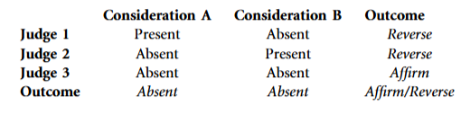
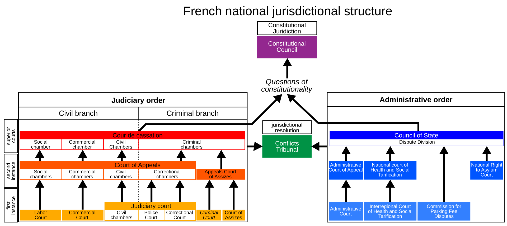

```{r globals, warning=FALSE, message=FALSE, error=FALSE}
source("utils/globals.R")
```

## Deciding together

-   most consequential decisions are not made by a single judge acting alone

-   this week: three settings in which the decision runs through other people

    -   **juries** and lay judges: citizens deciding next to or instead of professionals

    -   **panels**: judges influencing one another

    -   the **hierarchy**: courts overseen by the courts above them

# Juries

## Who decides besides judges? {.smaller}

| system | who decides | how chosen | decision rule |
|---------------------------|---------------------------------|--------------------|--------------------|
| jury (US, UK, Canada) | 6-12 citizens decide facts, the judge the law | at random from electoral rolls | (near-)unanimity |
| mixed tribunal (Germany, France, Sweden) | lay judges vote with professionals | by councils, parties or lot | majority, often qualified |
| lay judges (Japan, since 2009) | 6 citizens and 3 judges on serious crimes | at random | majority incl. a professional |
| lay magistrates (England) | volunteers on minor crime | appointed | majority |
| professionals only (Netherlands) | judges | | |

-   civil juries are rare outside the US; most of Europe uses lay judges rather than juries

## The Condorcet jury theorem

-   Condorcet (1785): a majority is more likely right than any one member, if

    -   **competence**: each member is more likely right than wrong

    -   **independence**: each member decides for themselves

-   the larger the group, the more likely the majority is right

    -   with jurors each right 60% of the time, a majority of 3 is right 65%, of 11 75%, of 51 93%

-   the standard argument for juries, panels and larger benches

## Real juries are not Condorcet juries

-   competence varies between jurors

-   votes are not independent: jurors deliberate first

    -   the informed persuade, or the confident dominate

    -   **group polarization**: groups end up more extreme than their median member

    -   the first ballot predicts the verdict in about nine juries in ten [@kalven1966american]

-   group decisions depend on who is in the room

## Who sits on the jury matters {.smaller}

-   Florida jury pools: with no Black member, Black defendants were convicted far more often than white defendants; one Black member in the pool closed the gap [@anwar2012impact]

-   jurors of the defendant's own gender are more lenient, so the gender mix of the pool moves conviction rates [@hoekstra2021effect]

-   randomly assigned Swedish lay judges from the far right convict young and Arabic-named defendants more often [@anwar2019politics]

-   in all three studies who ends up in the pool is as good as random, so differences in verdicts cannot come from the cases

## Deliberation and history {.smaller}

-   racially mixed mock juries deliberated longer, discussed more of the facts and made fewer factual errors than all-white juries [@sommers2006racial]

-   Old Bailey, 1715 to 1900: juries were less likely to convict a defendant right after convicting the previous one, a path dependency in sequential decisions [@bindler2019path]

-   over the same two centuries women were consistently treated more leniently than men [@bindler2020persistence]

-   what happens in the deliberation room remains the least observed step in any legal system

# Panels

## Collegial courts

-   most important courts are collegial – they involve bargaining between multiple judges

-   if opinion amendments by judges are costless, the result will align with the median judge's preferences

    -   if they are not, the opinion writer can pull the judgment slightly away from the median judge [@hangartner2025inferring]

## Chair or median? {.smaller}

-   Swiss Federal Administrative Court, 1,739 asylum appeals in 2007, panels of three drawn from about 30 judges elected by parliament under party quotas, no published votes or dissents [@hangartner2025inferring]

-   the model infers judges' preferences from panel outcomes and lets the data pick the **aggregation rule**: majority (median judge decisive), unanimity or chair-as-dictator

-   best fit is a mixture of chair rule and majority rule; the chair, who drafts the decision, prevails over the median in about 45% of cases

-   preferred grant rates run from 4.8% (Swiss People's Party) to 20.3% (Social Democrats); at least 8.4% of appeals would have gone the other way with a different panel

-   partisanship explains the disparities, deference to the chair the departures from majority rule – attitudinal and strategic accounts both apply

## Collegial courts

-   judges are affected by the ideology, gender and race of the judges they co-decide with [@boyd2010untangling; @grossman2016descriptive]

-   judges' mutual familiarity fosters openness and more extensive deliberation [@swalve2022does]

## Panel effects {.smaller}

-   on US three-judge panels, a judge sitting with two co-partisans votes more ideologically than the same judge sitting with two judges from the other party – **amplification** and **dampening** [@sunstein2004ideological]

-   one judge from the minority party on the panel is enough to make the majority follow doctrine more closely: the **whistleblower** effect, because a dissent invites review [@cross1998judicial]

-   panel composition is both a treatment (who influences whom) and a threat of exposure

## Panel aggregation paradox {.smaller}

{width="500"}

-   @landa2009legal highlight how aggregation of decisions on panels by majority might deviate from individual decisions on case components

-   if both considerations are absent, the decision should be upheld; judges decide by majority

-   there is evidence that judges who sit together on panels are capable of influencing each other [@grossman2016descriptive; @boyd2010untangling]

## Role of chambers

-   to increase efficiency, courts can create chambers consisting of sub-groups of judges

-   their composition can be more or less permanent and stable

-   but they undermine the court's consistency in applying rules [@fjelstul2023how]

## Case assignment

-   who decides who decides?

-   in some courts (e.g. CJEU), the president chooses the opinion writer (judge-rapporteur)

    -   a source of power to steer decisions in a desired direction [@hermansen2020building]

    -   at SCOTUS, the initial majority also gets the pen-holder [@lax2007bargaining]

## Case assignment

-   automatic systems of random case assignment as an anti-corruption measure [@marcondes2019assessing]

-   in some settings assignment of cases is plausibly quasi-random in expectation [@goldsmithpinkham2025leniency]

    -   conditional on some covariates, judges are assigned cases as if randomly

    -   more likely to hold when there is a large volume of cases

::: notes
the random or otherwise assignment of cases to judges is a critical element in research design
:::

## Random assignment as a research design {.smaller}

-   the recurring identification strategy in this literature: jurors drawn by lot, lay judges rotated by schedule, cases allocated to judges by rota or lottery

-   if assignment is as good as random, differences in outcomes across juries, panels or judges cannot be due to the cases they got

-   three things to check before believing it:

    -   was assignment actually random, or only "as if", conditional on court, time and case type?

    -   can judges or parties opt out (recusal, forum shopping, plea deals)?

    -   are there enough cases per judge to estimate anything?

-   the same design lets a judge's leniency serve as an instrument for what happens to defendants afterwards

## Role of clerks

-   judges do not work alone – they are assisted by law clerks

    -   their influence can be considerable and their selection is not random [@badas2024role]

-   judges, similar to politicians have different styles

    -   some are more willing to trust and delegate work than others

# Hierarchy

## Organizing the judiciary

-   how are judiciaries organized?

-   what are the implications of organizational principles for judicial decision-making?

## Judicial hierarchy

-   virtually all judiciaries around the world are organized hierarchically

-   three "layers" are typical

    -   supreme and constitutional (peak) courts at the top

    -   courts of appeal in the middle

    -   ordinary (lower) courts at the bottom

## Judicial hierarchy

-   peak courts = courts of final instance

    -   no more appeals possible

    -   of special significance in some jurisdictions (e.g. ECtHR)

-   in many systems there are multiple hierarchies

    -   e.g. military courts or administrative law (France)

## Judicial hierarchy



## Judicial hierarchy

-   in some circumstances, judicial hierarchies are not universally accepted

    -   in the EU, the CJEU proclaims the doctrine of supremacy of EU law over national law and its own role as the ultimate arbiter of EU law questions

    -   from the CJEU's perspective, all national courts must follow its lead

    -   not all national courts accept that the CJEU sits atop the EU law hierarchy

## Judicial hierarchy {.smaller}

> The Court of Justice of the European Union exceeds its judicial mandate, as determined by the functions conferred upon it in Article 19(1) second sentence of the Treaty on European Union, where an interpretation of the Treaties is not comprehensible and must thus be considered arbitrary from an objective perspective. **If the Court of Justice of the European Union crosses that limit**, its decisions are no longer covered by Article 19(1) second sentence of the Treaty on European Union in conjunction with the domestic Act of Approval; at least in relation to Germany, these decisions lack the minimum of democratic legitimation necessary under Article 23(1) second sentence in conjunction with Article 20(1) and (2) and Article 79(3) of the Basic Law.

German Constitutional Court, Judgment of the Second Senate of 5 May 2020, press release

## Judicial hierarchy

-   judges at different levels of the pyramid face different pressures and incentives

    -   at the bottom, the range of goals is the widest (e.g. routines, workload, promotion, policy)

    -   at the top, judges are mostly concerned with policy considerations and ideological influence is therefore the strongest [@zorn2010ideological]

## Judicial motivation

-   @goto2026career presents evidence of judicial pandering in Indian courts

    -   judicial leaders hold power over lower courts' judges promotion prospects

    -   eligible judges become more likely to acquit female defendants and less likely to acquit male defendants in the presence of a female chief justice

## Judicial discipline

-   discipline in the judicial hierarchy is maintained through two mechanisms:

    -   precedents or rules created by higher courts to be followed by lower courts

    -   oversight by higher courts or the threat of reversing lower court decisions

## Role of precedent

-   even jurisdictions which do not formally subscribe to *stare decisis* usually employ precedents

-   precedents transmit rules through time and the judicial hierarchy

-   courts higher in the hierarchy and later in time can amend or expunge lower or previous precedents

## Role of lower courts {.smaller}

-   in the standard account, lower courts implement the doctrines developed by peak courts

    -   they may try to make use of ambiguity to create room for their own preferences [@cameron2000strategic]

    -   upper courts correct their "errors"

-   in the 'reversed' account, lower courts make their own doctrines [@carrubba2012rule]

    -   they have a first-mover advantage and are closer to case facts

    -   upper courts intervene when lower courts go too far

## The cost of review

-   upper courts do not have direct and immediate access to case facts, only to lower courts' decisions

    -   they need to spend time and resources to find out more

    -   =\> upper courts need to decide which decisions are worth auditing

-   upper courts care about lower courts' dispositions and rules

    -   lower courts choose rules to avoid review [@carrubba2012rule]

::: notes
the ideal situation for the lower court is one like the following:

suppose the lower court is liberal and wants a liberal rule. The Supreme Court is more conservative. The facts are such that the adoption of almost any rule would yield the disposition desired by the SC. But the lower court can push the rule further in its preferred direction because the "correct" disposition will to some extent shield it from review
:::

## The cost of review

-   the ideal situation for the lower court is when the disposition aligns with the upper court's preferences

-   suppose the lower court prefers a liberal rule, while the upper court is more conservative. The facts are so extreme that almost any rule yields a "conservative" disposition (e.g. harsh sentence). The lower can push the rule in a liberal direction because the upper court will be satisfied with the disposition regardless

## The threat of reversal {.smaller}

-   why do lower courts follow precedent? why do they fear reversal?

    -   reputation

    -   belief in legal principles [@cross2005appellate]

    -   they want to have influence over the law [@carrubba2012rule]

-   interpersonal contacts between lower and appeal judges dampen the effect of ideological distance [@nelson2022how]

    -   when the lower and appeal judges work in the same courthouse, ideological distance becomes irrelevant

## The threat of reversal

-   appeal courts pick up on signals ("fire alarms" / whistleblowing) about whether a decision is worth reviewing

    -   litigants filing appeals

    -   interest groups filing amici curiae briefs

    -   lower court judges dissenting [@beim2014whistleblowing]

::: notes
if the whistle is blown too often, the signal becomes less informative and easier to ignore for the lower court, leading to lower compliance with upper court doctrine
:::

## The effect of reversal

-   trial judges in Norway who had their ruling overturned on appeal shift their behaviour in the corresponding direction [@bhuller2025feedback]
    -   "Following a decision reversal, trial judges who receive a sentence increase have almost 40 percentage points higher probability of incarcerating in the next case, compared to judges receiving a sentence affirmance"
    -   judges do not merely "learn" from reversals but overreact to them

## The effect of reversal

-   in the European Union, national courts submit cases to the Court of Justice of the EU (CJEU). What happens these cases are rejected by the CJEU?

-   national courts receiving such a negative result are more likely to submit another case [@dyevre2022chilling]

    -   the CJEU is more likely to accept requests from national courts that previously experienced rejection

## When judges decide together, whose preferences end up in the ruling?

## References
