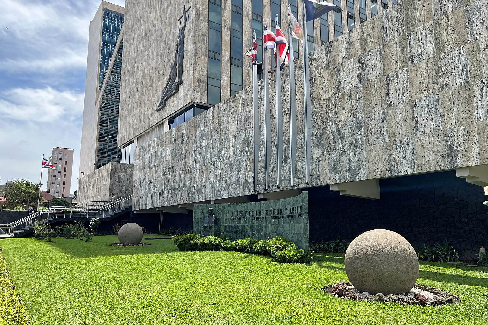
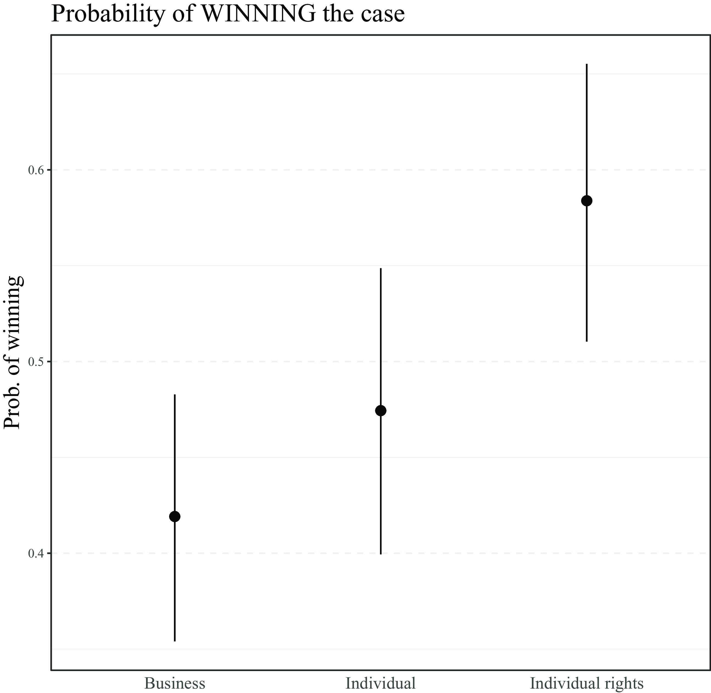

```{r globals, warning=FALSE, message=FALSE, error=FALSE}
source("utils/globals.R")
```

## Assessment {.smaller}

-   deadline: **TBC**

-   what **theory** do you want to contribute to with your empirical analysis?

    -   derive a specific **hypothesis** from theoretical discussion

-   what **data** are you going to use to test your hypothesis?

-   what **method** are you going to use to analyse your data?

## Empirical paper {.smaller}

-   **Introduction**: what is the research puzzle/problem and why is it important?

-   **Literature review**: what we already know about the problem from previous research and what gap is going to be addressed by your paper

    -   examples of a gap: all evidence comes from a single jurisdiction; there is conflicting evidence; existing theories do not account for an important variable; etc.

-   **Theory**: a reasoned justification of (the logic behind) your principal expectation (**hypothesis**) prior to conducting the empirical analysis; must be informed by existing literature

    -   what puzzle does your theory attempt to explain?

    -   example of a hypothesis: "The likelihood of \[Supreme Court\] review should initially decrease and then increase in ideological distance \[from the lower court\]."

    -   what is your explanatory (independent) variable? What is your outcome (dependent) variable?

## Empirical paper {.smaller}

-   **Data:** information used to produce evidence and test your hypothesis

    -   which cases will offer leverage on your research problem?

    -   how do you operationalize your theory (variables) in data? What is the unit of analysis?

    -   what measurement choices were made in the construction of the dataset?

    -   you can use an existing dataset or collect your own data

    -   even in qualitative research keep meticulous track of your sources (transparency appendix)

-   **Methods/research design**: the empirical strategy applied to your data in order to test your hypothesis

    -   how do you analyse your data?

    -   what valid inferences can be made based on your method? e.g. average treatment effects vs mechanistic evidence

    -   what are the assumptions and limitations of the method?

## Empirical paper {.smaller}

-   **Findings and discussion**: the results produced by your empirical strategy and data

    -   what are the results of your analysis?

    -   what are the implications for your hypothesis? is there evidence in support or against it?

    -   what are the implications for the broader theory and literature?

    -   what have we learned that we did not know before?

-   **Conclusion**: summarize findings, highlight main contribution and limitations, and offer thoughts on policy and future research avenues

## Legal mobilization

-   What kinds of individuals and groups resort to litigation?

-   What influences the likelihood of interest group litigation and what makes their success likely?

-   courts are passive: nothing happens until someone brings a case

## Legal mobilization

-   "invoking legal norms as a form of political activity by which the citizenry uses public authority on its own behalf" [@zemans1983]

-   the enforcement of the law often depends on private (non-governmental) actors

    -   traditionally in the US ("adversarial legalism"), possibly also in the EU [@kelemen2012]

## Adversarial vs bureaucratic legalism

-   law and policy in the US are strongly shaped by means of "lawyer-dominated **litigation**" [@kagan2003adversarial]

-   economic liberalization and political fragmentation in the EU has been argued to be leading Europe down the American path [@kelemen2012]

-   some private enforcement but role of state **bureaucracies** in implementation (centralized, hierarchical) remains strong in Europe – resistance to the US model [@foster2024]

## Legal mobilization

-   "*the process by which individuals make claims about their legal rights and pursue lawsuits to defend or develop those rights*" [@epp1998rights, p. 18]

    -   "claims" not strictly invoking formal institutional mechanisms

    -   what exactly counts as legal mobilization is this week's conceptual reading

## Why mobilize the law?

-   most often targeting **legal change** through courts ("strategic litigation")

-   raise rights consciousness and improve **receptivity** to claims

-   generate media **attention** and public support

## Why not?

-   fear of creating **negative precedents** entrenching unfavourable outcomes

-   change through courts lacks in **democratic** legitimation

-   fear of **backlash** against the pursued cause

    -   but other forms of policy change can also generate backlash [@keck2009]

# Individuals

## From injury to lawsuit {.smaller}

-   most injuries never become disputes, let alone cases: an injury has to be perceived (**naming**), attributed to someone (**blaming**) and put to them (**claiming**) before any court is involved [@felstiner1981]

-   each step is subjective, unstable and shaped by lawyers, insurers, family and the media

```{r pyramid, fig.height=3.5}
tibble(stage = c("grievances", "claims", "disputes", "lawyer consulted", "court filings"),
       n = c(1000, 718, 449, 103, 50)) |>
  mutate(stage = factor(stage, levels = rev(stage))) |>
  ggplot(aes(x = n, y = stage)) +
  geom_col() +
  geom_text(aes(label = n), hjust = -0.2) +
  scale_x_continuous(expand = expansion(mult = c(0, 0.15))) +
  theme_minimal() +
  labs(x = NULL, y = NULL,
       title = "The dispute pyramid",
       subtitle = "Per 1,000 grievances, US households, 1980",
       caption = "Source: Miller and Sarat (1981)")
```

## Legal mobilization in Costa Rica

-   in 1989, the Costa Rican constitution was reformed to create a constitutional chamber in the Supreme Court

    -   @wilson2006 argue that marginalized groups managed to score significant wins without organization and resources due to very permissive access

    -   the existence of an expansive list of rights as a prerequisite

::: notes
As an example, there was a successful suit resulting from a handwritten complaint without legal counsel by a 10-year old
:::

## Legal mobilization in Costa Rica



## Individuals without organizations {.smaller}

-   Colombia's *acción de tutela* (1991): any person can file a complaint for the protection of a fundamental right, without a lawyer, and get a decision within ten days

    -   hundreds of thousands of tutelas a year, most of them about health care and pensions

    -   Colombians report very low trust in the judiciary and file tutelas in enormous numbers anyway [@taylor2018]

-   cheap and simple procedure makes claims individual (Colombia); costly and technical procedure makes them collective and lawyer-led (South Africa) [@taylor2020]

-   cheap access substitutes for the support structure that the US literature treats as necessary

# Organizations

## The drivers of legal mobilization

-   LM requires capacity to navigate a complex organizational field

-   actors need to have the necessary resources (financial, expertise) to take advantage of the available *legal opportunity structure* (LOS)

    -   but LOS is not just exogenously given, acting on it shapes it going forward [@vanhala2012]

## Legal opportunity structure (static)

-   legal **stock**

    -   what rights and laws are available to "hang" your case on?

-   **access** to justice

    -   who can access the procedure and under what conditions?

-   legal **costs**

    -   how expensive is it to access the procedure and is legal aid available?

## Legal opportunity structure (dynamic)

-   the text of a law is just the starting the point of law construction

    -   rules need to be interpreted in the process of being applied

-   actors attempt to mould LOS to their advantage by advancing new interpretations

    -   most commonly they are targeting judges but there are other options (e.g. MPs, ombudsmen)

    -   some might not see an opportunity where there is one [@vanderpas2024]

## Empirical examples

-   civil rights movements

    -   *Brown v Board of Education of Topeka* (1954)

    -   open LOS in US v closed LOS in NI [@defazio2012]

## Empirical examples

-   environmental movements [@vanhala2022]

    -   Aarhus Convention

    -   climate litigation [@setzer2019; @voeten2024]

## Empirical examples

-   LGBTQ+ movements [@keck2009]

    -   decriminalization, recognition, same-sex marriage

    -   international courts can help [@helfer2014]

## Litigate or lobby? {.smaller}

-   groups with good access to policymakers lobby; those shut out, or aiming at settled law rather than new law, litigate [@bouwen2007]

-   a survey of German organized interests, including firms: how often an organization litigates is predicted by its in-house legal staff and its membership structure, not by its money [@thierse2026]

-   litigation needs legal expertise more than cash

## Mobilizing the law from the right {.smaller}

-   the literature grew up around progressive movements, but conservatives litigate too

-   Colombian conservatives fought LGBT rights in Congress and the streets until 2007, then in the Constitutional Court once its rulings threatened them

    -   legal **threats**, not only opportunities, trigger mobilization [@lehoucq2021]

-   a 2026 special issue maps right-wing legal mobilization from Egypt and Tunisia to Sweden and Chile: criminal law, constitutional freedoms and procedure used against the rights of others [@escoffier2026]

-   is this backlash, or simply mobilization by the other side?

## Role of international law

-   chances are the LOS is in a stable equilibrium due to well-defined and entrenched preferences of the executive, legislature and courts

-   there is a huge literature on international law and courts disrupting such domestic equilibria and creating new opportunities for actors [@helfer2014; @simmons2009mobilizing; @alter2000; @pavone2019]

    -   domestic political players have less control over the international LOS

# Lawyers

## Lawyers as mobilizers {.smaller}

-   the founding story of EU law has rights-conscious litigants and activist judges

    -   in fact a handful of **Euro-lawyers** found the clients, built the test cases and ghostwrote the referrals reluctant national judges sent to Luxembourg [@pavone2022ghostwriters]

-   **cause lawyers** put a political commitment before the client's case (Sarat and Scheingold 1998); the tension is with professional norms of neutrality

-   does having a lawyer matter? in a randomized experiment in New York's housing court, tenants offered free counsel were far less likely to be evicted [@seron2001]

-   lawyers are repeat players even when their clients are not – this week's Galanter reading

# Who litigates and who wins

## Who litigates? {.smaller}

-   until the 1930s, 90% of the SCOTUS docket was formed by business and property cases [@epp1998rights]

-   in the 1960s individual rights litigation at SCOTUS reached 70%

    -   most cases were sponsored by NGOs such as ACLU and NAACP

-   contrast with lack of success of Indian Supreme Court in the 1990s despite efforts to invite more rights cases

-   disagreement about the importance of the "support structure" [@sanchezurribarri2011; @epp2011]

## Who litigates?

-   the equalizing potential of the law is limited in practice by resource inequality – this week's Galanter reading

-   more resourceful actors litigate more [@hofmann2021]

    -   but mixed evidence regarding proximity to power [@coglianese1996]

-   some repeat players are just chronically bad businesses who also lose cases [@volkov2023]

    -   decouple party capability from repetitiveness

## Who wins?

-   those who litigate more are usually also more likely to win

-   individuals are the least likely to win cases in the US, followed by interest groups (heterogeneous) and governments

-   government lawyers often tend to be more successful than private lawyers

    -   e.g. the US Solicitor General's *certoriari* petitions to SCOTUS have a success rate of 70% compared to 3% for others [@chandler2011; @black2011; @bailey2005]

::: notes
role of US SG somewhat similar to role of the Commission in the EU system - also wins a lot and indicates what the pro-EU position is. But maybe COM and CJEU are more ideologically aligned
:::

## Who wins?

-   broad evidence base showing that party capability predicts success before courts [@mccormick1993]

    -   attorney experience before SCOTUS [@nelson2022a] and US immigration courts [@miller2015] helps litigants win

    -   the "haves" hire better lawyers than the "have nots" which is why they win more often [@szmer2016]

## Who wins in international courts?

-   @hermansen2025leveling ask whether international courts amplify the power of the already powerful

    -   they find that instead the ECJ favours less privileged litigants ("leveling") and "spotlights" those rulings which enhance individual rights

    -   suggests ICs are consciously trying to build up their popular legitimacy

## Who wins in international courts?



## Why do plaintiffs win half the time? {.smaller}

-   across many courts and case types, plaintiffs win close to half of the cases that go to judgment

-   @priest1984: cases settle when both sides agree on the likely outcome; only the close calls reach trial, so trial outcomes say little about how the law treats plaintiffs in general

-   observed litigation is a **selected sample** of disputes, selected by the parties' expectations

    -   a court that rules for the government 90% of the time may be captured, or may face a government that only litigates when it expects to win

    -   win rates are not bias rates

-   the selection curve on legal ambiguity is the same idea seen from the judge's side

## Four puzzles

-   plaintiffs win about half the time almost everywhere – is the law that balanced, or are we only seeing the close calls?

-   the haves come out ahead in domestic courts, yet the ECJ appears to favour the weak

-   the US literature says rights revolutions need support structures; Costa Rica and Colombia got theirs from a cheap procedure and no organization

-   Europe was supposed to go American with more adversarial legalism; its bureaucracies kept implementing instead

## References
