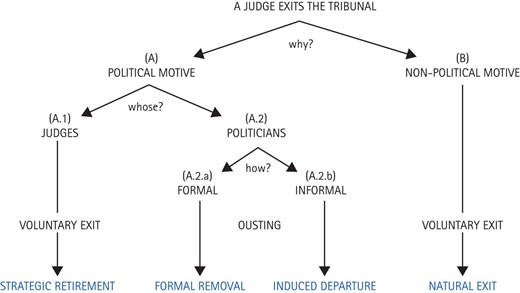

```{r globals, warning=FALSE, message=FALSE, error=FALSE}
source("utils/globals.R")
```

## Controlling the judiciary

-   how do politicians keep tabs on judges?

-   how do they ensure that delegation of judicial power does not go beyond what they originally envisaged?

-   how do judges govern themselves?

## *Ex ante* and *ex post* control

-   we can generally divide tools of political control in two categories [@helfer2005why]

    -   *ex ante*: mechanisms of control designed prior to the court's operation

    -   *ex post*: mechanisms of control developed in response to the court's operation

## Jurisdiction {.smaller}

-   a key decision liable to influence how much and over what types of issues a court has power concerns **jurisdiction** (or access / standing / *locus standi*)

-   jurisdiction is about regulating access to courts

    -   in general, the more actors can access a court, the greater its power

-   there are multiple ways of defining (= constraining) a court's jurisdiction and usually more than one is used at once

    -   geographical (e.g. US Courts of Appeals)

    -   substantive (e.g. UK Supreme Court re Scottish criminal law; higher courts ruling on "points of law only")

    -   personal (e.g. ECJ rules on standing)

## Jurisdiction (personal)

-   the CJEU has famously restrictive access rules for private litigants

> Any natural or legal person may \[...\] institute proceedings against an act **addressed to that person** or which is of **direct** and **individual** **concern** to them, and against a regulatory act which is of direct concern to them and does not entail implementing measures.

# Who becomes a judge?

## Who becomes a judge?

-   if judges were randomly sampled from a country's population, their preferences would be on average (in expectation) similar to the population's

    -   there would also be a lot of heterogeneity (as much as in the population)

-   in reality, judicial preferences are **systematically** influenced by a set of institutional factors

## Selection effects

-   what needed to happen for someone to become a judge on court X?

    -   what kind of person wants to become a legal professional? (*internal*)

    -   what kind of person is likely to be appointed a judge? (*external*)

-   answers to these questions will be shaped by institutional features

## Gender variation on the bench

-   judges' gender systematically influences judicial preferences, at least for some types of cases

-   the proportion of female judges varies greatly between countries

    -   around 30% in common law countries

    -   over 70% in some post-socialist countries

-   reforming the selection process speeds up the appointment of the first woman to a peak court [@arrington2021constitutional]

## Women in the Czech judiciary {.smaller}

-   @havelkova2022family illustrate the impact of institutional factors on gender representation in the Czech judiciary

-   low importance and prestige under socialism resulted in many female judges (60+%)

    -   low salary (relative to lawyers) perpetuate the inequality post-socialism

    -   standard working hours (relative to lawyers) attract more women due to childcare

-   despite higher overall numbers, the most important positions are occupied by men

    -   the childcare penalty hampers career progression but female judges largely accept their situation as given [@urbanikova2024art]

## Who ends up on the bench? {.smaller}

-   gender is the visible dimension; class and education are the quiet ones

-   senior judges in England and Wales: 62% privately educated (7% of the population), 75% went to Oxford or Cambridge, and over half did both (Sutton Trust 2025)

    -   barely changed since 2019; the bench turns over slowly and its pipeline runs through a handful of chambers

-   the mechanism is the *internal* selection effect: who can afford the unpaid years at the bar, who gets the pupillage, who is asked to apply

# Appointments

## Appointment procedures

-   the most salient *ex ante* mechanism

-   the institutional designer and appointer balance their preferences for judicial independence and accountability [@dunoff2017judicial]

-   there is considerable variety in how judges are appointed around the world

## Variation in appointment procedures

```{r appointvar}

# data from Oxf handbook
comp <- tribble(
  ~dominant, ~n,
  "executive", 46,
  "legislature", 17,
  "courts", 1,
  "mixed", 72,
  "council", 76
)

# plot
comp |>
  ggplot(aes(x = n, y = reorder(dominant, n))) +
  geom_col() +
  theme_minimal() +
  labs(x = "Number of courts", y = "Dominant influence in selection",
       caption = "Based on Tiede (2024)")
```

## How can judges be chosen? {.smaller}

| who chooses | examples | predicted effects |
|--------------------------------|--------------------------------|------------------------------------|
| executive alone | many presidential systems | loyal judges; fast, politicized |
| executive with legislative confirmation | US federal courts | confirmation fights; vacancies under divided government |
| legislative supermajority | German Constitutional Court | consensus candidates; party quotas |
| judicial council | Italy, Spain, much of Latin America | insulation; risk of corporatism or capture |
| mixed, each branch appoints a share | Spanish and Italian constitutional courts | each appointer picks allies |
| election | 38 US states, Bolivia, Mexico | accountability; campaign money |

## Appointment procedures {.smaller}

-   mixed systems encourage a tendency for each appointing branch to select judges most closely aligned with its interests

    -   this cleavage may supersede partisan preferences [@tiede2020mixed; @tiede2024selecting]

-   mixed systems can hinder the functioning of collegial courts

    -   but greater diversity can also improve the quality of decisions

-   more veto players =\> more moderate judges

## Judicial councils

-   institutional vehicle for judicial self-governance

-   in charge of appointing judges, managing budgets, promotions and discipline

-   strongly promoted by international organizations in the 2000s

-   trade-off between insulation and external accountability [@garoupa2009guarding]

::: notes
talk about composition:

-   are judges dominant? peak or ordinary?

-   who else appoints members?
:::

## Appointing international judges {.smaller}

-   most international benches are filled in two steps: governments **nominate**, an assembly **elects**

    -   ECtHR: each state sends three names, the Parliamentary Assembly of the Council of Europe elects one

    -   ICJ: elected by the UN General Assembly and the Security Council from national-group nominations

    -   CJEU: governments appoint by common accord after a hearing before the Article 255 panel

-   the Article 255 panel has found about one in five first-time candidates unsuitable since 2010, and governments have followed every opinion; renewals are never rejected

-   governments nominate judges whose views match theirs [@voeten2007politics]; the politics of selection across international courts is reviewed by @larsson2023selection

## Confirmation wars {.smaller}

-   US Supreme Court confirmations have turned into national campaigns: senators' votes follow their constituents' opinion of the nominee [@kastellec2010public]

-   when the branches are divided, the appointment power becomes the power not to appoint

    -   the Senate left Merrick Garland's 2016 nomination without a hearing for nine months, then confirmed Amy Coney Barrett in five weeks in 2020

-   shared appointment power moderates judges only when the sharers must agree; when they can wait each other out, it produces vacancies and escalation

# Tenure and monitoring

## Tenure

-   the tenure of judges can differ markedly by country and type of court

    -   most ordinary judges are appointed for life, sometimes with age limits

    -   judges on constitutional and international courts are often term-bound and can sometimes be reappointed

::: notes
UK Supreme Court has mandatory retirement at 75

ICJ judges have 9-year tenure

ECtHR judges had their tenures increased from 6 to 9 but made non-renewable
:::

## Reappointment

-   the prospect of **reappointment** influences judicial behaviour [@hall2014representation]

    -   judges who are up for reappointment are more responsive to the preferences of their principal

    -   tested at the ECtHR [@stiansen2022nonrenewable] and the CJEU [@hermansen2026shaping]

-   non-renewable terms can however damage a court's effectiveness

    -   turnover can affect retention of expertise

## Transparency

-   the principals' ability to monitor (and therefore punish/reward) judicial behaviour is conditional on **transparency**

-   while decisions are always public, individual votes and dissents are not

-   do principals have other means of obtaining information about the voting of judges?

## Renewal and transparency

|                            |                      |                       |
|----------------------------|----------------------|-----------------------|
|                            | **Low transparency** | **High transparency** |
| *Life tenure*              | Low incentive        | Low incentive         |
| *Renewable fixed term*     | Low incentive        | High incentive        |
| *Non-renewable fixed term* | Low incentive        | Low incentive         |

: Interaction of renewal opportunities and transparency for judges' incentives to appease principals

## The monitoring toolkit {.smaller}

| tool | who uses it | what it reveals or punishes |
|------|------|------|
| reappointment and promotion | governments, court presidents, councils | rewards deference |
| transparency of votes and dissents | everyone | who voted how; dissents at the ECtHR, none at the CJEU |
| performance evaluation and case statistics | councils, ministries | speed and output, not direction |
| disciplinary regimes | councils, special chambers | misconduct |
| budgets and staffing | legislatures, ministries | capacity; hits the whole institution |

## Judicial exits

-   judges are rarely forced out of office through removal procedures

-   the motivations behind a judge quitting can be more varied however

## Judicial exits



## Strategic retirements {.smaller}

-   hypothesis: federal judges in the US prefer to retire under presidents of the same political party that first appointed them [@stolzenberg2022judges; @nixon2000judicial]

    -   @stolzenberg2022judges argue that this behaviour is driven more by reciprocity norms (giving back to appointing party) than ideology

    -   in contrast, @deschler2024role show that recently, moderate Republican judges have withheld retirement under more conservative presidents such as Trump (ideology \> partisanship/reciprocity)

-   older judges are more inclined to retire strategically [@hansford2010politics]

-   understudied outside the US [@perezlinan2017strategic]

# Elections

## Judicial elections

-   perceived rejection of "elite-driven" judicial selection

-   tried out in revolutionary France (1790) and Central America post Spanish independence

-   38 US states (as of 2024) elect judges to state supreme courts [@lim2013preferences; @lim2015judge; @besley2013implementation]

    -   the 2023 Wisconsin Supreme Court election saw 51 million USD in campaign spending

::: notes
the Wisconsin figure is only slightly less than total party spending in the 2019 UK general election. Wisconsin has a population of less than 6 million (cf UK almost 70)
:::

## Electing judges outside the US: Bolivia {.smaller}

-   @driscoll2015judicial show the impact of Bolivia introducing judicial elections in 2011

    -   judges became much more diverse as a result (in contrast to the US)

    -   confidence in the judiciary increased among government supporters but declined overall

-   in both 2011 and 2017 more than half of the ballots cast were blank or spoilt

-   the 2024 election was delayed for years by disputes over candidate screening and held only in part

## Electing judges outside the US: Mexico {.smaller}

-   1 June 2025: the first election of an entire national judiciary anywhere, following the 2024 constitutional reform

    -   all nine Supreme Court seats, the electoral tribunal, a new judicial disciplinary tribunal and hundreds of federal judgeships on one ballot

    -   candidates pre-screened by evaluation committees of the three branches; no party labels on the ballot

-   turnout around 13 percent, the lowest of any federal vote in Mexico's democratic history

-   the winners overwhelmingly aligned with the governing party Morena; the remaining posts are up in 2027

-   the stated aims were to democratize an elitist judiciary and end corruption; the effect is a judiciary chosen under one party's dominance

## Reforms as natural experiments {.smaller}

-   appointment and tenure rules rarely change; when they do, the change is a **shock** we can learn from

-   the logic of a difference-in-differences: compare judges or courts exposed to the reform with those not exposed, before and after; the untouched group supplies the counterfactual trend

-   Bolivia 2011: the first popular election of high court judges changed who sat on the bench and how the public rated it [@driscoll2015judicial]

-   the requirement is that nothing else changed at the same time for the treated group only

## Can judges be made accountable without being made dependent?

## References
