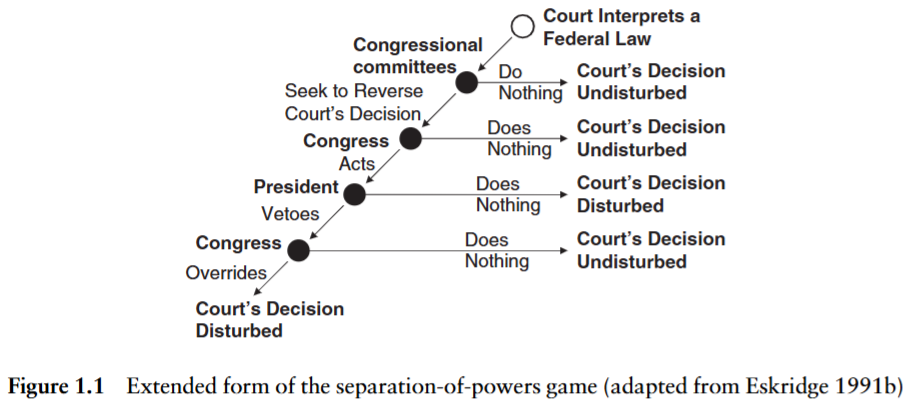
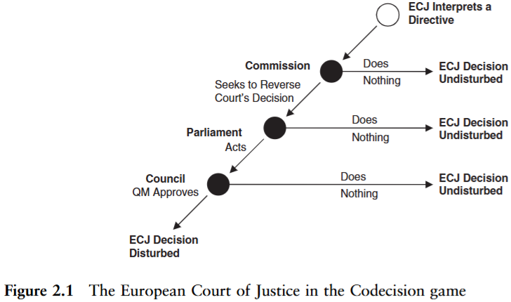
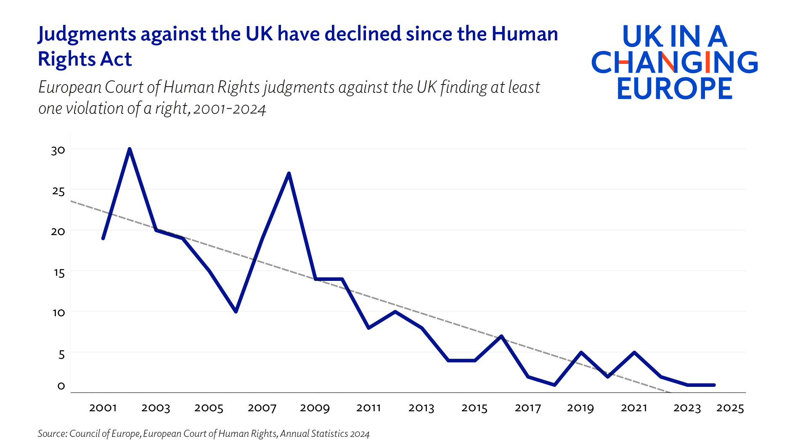

```{r globals, warning=FALSE, message=FALSE, error=FALSE}
source("utils/globals.R")
```

## Strategic interactions

-   How do courts, executives and legislatures interact in the enactment and enforcement of policy?

-   How does strategic anticipation of mutual preferences affect how they behave?

-   What happens when elected politicians decide to push back against courts?

-   And can courts be captured without formal control?

# Anticipation

## Judicial review

-   constitutional (and sometimes ordinary) courts have in many jurisdictions the power of judicial review

-   the legislating body knows its acts can be reviewed

-   courts depend on the executive branch for enforcement

    -   public support for courts makes enforcement more likely

## Anticipating judicial review

-   in general, legislators want to avoid having their laws struck down by judges

-   what is the chance the act will be **reviewed**?

    -   shaped by rules on jurisdiction and judicial review

-   what is the chance the act will be **overturned**?

    -   shaped by distance between legislator and court

## Anticipating judicial review

-   the legislature only needs to fear the courts when judicial review is likely to happen

-   in some countries this is virtually guaranteed (e.g. US), while elsewhere there will be more uncertainty

    -   in the EU, if all political actors agree, there is very low chance of review

## Anticipating judicial review

-   the legislature only needs to fear the courts when they prefer to overturn an act

-   the legislature will look for information on:

    -   the court's previous case law

    -   judges' ideological positions

    -   public support

## Anticipating judicial review

-   in reality, no actor has complete and perfect information about the judicial review game

    -   there is **uncertainty** about how the courts will react

    -   actors sometimes behave irrationally

-   the legislator might water down an act or otherwise preempt negative judicial action

## Anticipating judicial review

-   in some cases, the legislator will not shy away from judicial conflict [@schroeder2022pushing]

    -   when they have strong public support [@vanberg2001legislativejudicial; @krehbiel2016politics]

    -   when they signal intention to not comply

## Anticipating reactions

-   courts have also reasons to fear confrontation

    -   **non-compliance** undermines their power and legitimacy

    -   may trigger **court curbing** by the other branches

    -   just like legislatures do not want to be censored by courts, courts do not want to be **overridden** by legislatures

## Threat of override

-   courts may also take into account whether their decision is likely to be overridden by the legislature [@meernik1997judicial; @larsson2021political]

    -   though the empirical evidence of override anticipation by courts is mixed [@segal1997separationofpowers; @segal2011congress]

-   courts are looking for judgments which are as close as possible to their ideal point but not so far as to get overridden

## Threat of override



## Threat of override



## The override incongruity {.smaller}

-   the literature leans heavily on the **threat** of override: courts anticipate it, and the CJEU visibly responds to member-state signals of displeasure [@larsson2016judicial]

-   yet actual overrides of CJEU rulings are close to non-existent: treaty-based rulings need treaty change, the rest a coalition that rarely forms (the joint-decision trap)

    -   in EU social policy, codification and override are both rare

-   the US is the mirror image: Congress overrode Supreme Court statutory decisions routinely in the 1970s and 1980s [@eskridge1991overriding; @uribe2014influence], a record that has thinned since (Christiansen and Eskridge 2014)

-   so the system where override is least feasible is the one where the court looks most responsive to it

-   **observational equivalence**: zero observed overrides is consistent with perfect anticipation and with no constraint at all; only variation in signals, or the rare off-path case, can tell them apart

## The friendly court

-   consistent with the idea of the majoritarian court is evidence of courts ruling against policies of previous governments [@segal2011congress; @gillman2002how]

    -   a "friendly" judicial intervention can be particularly valuable when it concerns constitutional interpretation that would be otherwise difficult to legislate away (e.g. *Roe* and *Dobbs*)

    -   also helps explain why governments might sometimes appear to support "activist" judiciaries [@whittington2005interpose]

# Curbing

## Court curbing

-   the legislator signaling intent to engage in court curbing is likely to lead to judicial self-restraint

-   a number of possible measures:

    -   budget and staffing cuts

    -   induced judicial exits (e.g. lowering retirement age)

    -   court expansion and packing

    -   limiting jurisdiction and powers

## The court-curbing toolkit {.smaller}

| target | tools |
|------|------|
| composition | packing, retirement-age cuts, captured appointment bodies, transfers |
| jurisdiction | stripping subject matter, restricting standing, special tribunals |
| operation | budget cuts, disciplinary regimes, court presidents' powers, caseload manipulation |
| decisions | override, constitutional amendment, non-compliance, unpublished rulings |
| legitimacy | "enemies of the people" rhetoric, smear campaigns, judicial elections |

-   the tools are old; in the 2010s they were used together and openly

## Ten years of attacks on courts {.smaller}

| case | tools | outcome |
|--------------------|----------------------------------------------------|----------------------------|
| Hungary 2010-13 | jurisdiction stripped, court enlarged, retirement age cut | captured |
| Poland 2015-23 | elected judges not sworn in, council captured, disciplinary chamber | tribunal captured, EU sanctions |
| Turkey 2010, 2016 on | court and council reshaped; 4,000+ judges and prosecutors dismissed | captured |
| Venezuela 2004 | Supreme Tribunal enlarged from 20 to 32 | captured |
| El Salvador 2021 | constitutional chamber removed on the new assembly's first day | captured |

::: notes
The illiberal playbook for constitutional courts is set out by Castillo-Ortiz (2019) and the postcommunist cases by Bugarič and Ginsburg (2016): capture composition first, then jurisdiction, and use ordinary legislation wherever a supermajority is not available.
:::

## Ten years of attacks on courts {.smaller}

| case | tools | outcome |
|--------------------|----------------------------------------------------|----------------------------|
| Israel 2023 | reasonableness standard abolished | struck down after mass protests |
| United States 1937, 2020s | court-packing plan; expansion commission | failed |
| United Kingdom 2016-22 | "enemies of the people"; limits on review remedies | rhetoric loud, curbing modest |

## Why attack, why refrain, how courts respond {.smaller}

-   **why attack**

    -   to signal a risk to the court's legitimacy and induce restraint [@clark2009separation]

    -   to remove a check on power: abusive constitutionalism [@landau2013abusive], autocratic legalism [@scheppele2018autocratic; @castilloortiz2019illiberal; @bugaric2016assault]

    -   to punish defecting judges [@helmke2002logic], often in populist terms [@voeten2020populism]

-   **why refrain**

    -   electoral costs, if voters punish attacks [@driscoll2023costs]

    -   international audiences: the EU, the ECtHR, investors

    -   insurance: today's majority is tomorrow's minority

-   **how courts respond**: defect, restrain themselves [@stiansen2020backlash], resist openly or exit

# Backlash and backsliding

## Backlash


## Backlash against courts

-   what drives **backlash** against international courts?

    -   probably the same thing that drives backlash against domestic courts: disagreement with outcomes

    -   populism is at best a partial explanation [@voeten2020populism]

-   *political* backlash against courts is distinct from backlash in public opinion

## Backlash against courts

-   evidence of greater **self-restraint** in response to backlash

    -   the ECtHR restricted the scope of human rights and increased governments' margin of appreciation (discretion) [@helfer2020walking]

    -   it also finds fewer violations by democracies that criticized it [@stiansen2020backlash]

## Declining UK ECHR violations



## Judicialization and politicization {.smaller}

-   courts expand their power through decisions on **public** policy and state institutions

    -   such matters naturally invite *politicization* which can lead to decline of trust in the long-run

-   as courts grow in importance, they also become more interesting to the public and attractive to **politicians**

    -   *judicialization* –\> *politicization*

-   politicians do not act merely within the rules but also **with respect** to the rules (existing institutions)

    -   if e.g. packing a court with loyalists helps to win power or realize political preferences, they will often do it

## Politicization

-   beyond court curbing measures enacted by politicians, law and courts can become **politicized** also by

    -   judicial elections

    -   high-profile decisions

    -   political polarization

    -   autocratization

## Dejudicialization {.smaller}

-   is the era of increasing judicialization over? [@abebe2019dejudicialization]

    -   most obvious in the backlash against international courts, e.g. dejudicialization of the WTO

-   but there are also signs in domestic politics

    -   e.g. the near total de-legitimization of the Polish Constitutional Court in recent years, conservative backlash in Israel, Turkey and elsewhere
    -   open question whether backlash and counter movements will sustain judicialization or reverse it through institutional attacks

## The EU's rule-of-law toolbox {.smaller}

-   **Article 7 TEU**: the political procedure, triggered against Poland (2017) and Hungary (2018), never reached sanctions because the final step needs unanimity minus the target

-   **infringement actions**: the Commission takes the member state to the CJEU – Hungary's retirement-age cut (2012), Poland's Supreme Court law (2019) and disciplinary regime (2021)

-   **preliminary references**: national judges ask the CJEU whether their own country's judicial reforms are compatible with EU law, turning Luxembourg into an ally of domestic courts

-   **conditionality**: since 2021 EU funds can be withheld for rule-of-law breaches; Hungary lost access to billions, Poland's recovery funds stayed frozen until 2024

-   the ECtHR joined in: in *Xero Flor* (2021) it found the Polish Constitutional Tribunal no longer a "tribunal established by law"

-   the tools bite slowly, mostly after the capture is complete

# Capture

## Capture without formal control {.smaller}

-   many interactions between courts and representatives of other branches can occur outside formal contexts

-   as members of the elite with access to power and resources, both judges and politicians can face incentives to confer special treatment

    -   e.g. judges may shield corrupt politicians from prosecution in exchange for bribes or career progress

    -   governments can reward judges with housing, as in Pakistan [@mehmood2024judicial]

-   (narrowly) winning a seat in Indian state legislature decreases the chance of criminal conviction by \~20 pp, but only for ruling party co-partisans [@pobletecazenave2025do]

-   narrowly winning a mayoral election in Brazil cuts the chance of conviction by \~11 pp, though mayors have no formal power over judges [@lambais2023judicial]

-   de jure separation is not sufficient to capture intended benefits of judicial independence – and these are democracies

## Regression discontinuity {.smaller}

-   when a treatment switches on at a threshold, units just above and just below it are comparable; the jump in outcomes at the threshold is the effect

-   close elections are the classic case: a mayor who won by a handful of votes and one who lost by a handful are alike in everything but office

-   used for the Indian and Brazilian results [@pobletecazenave2025do; @lambais2023judicial]

-   what to check: are there enough close races? does anything else change at the threshold? can candidates manipulate who wins narrowly?

-   the design shows whether holding power bends courts without observing the bending

## Why do governments that could ignore courts bother to capture them?

## References
