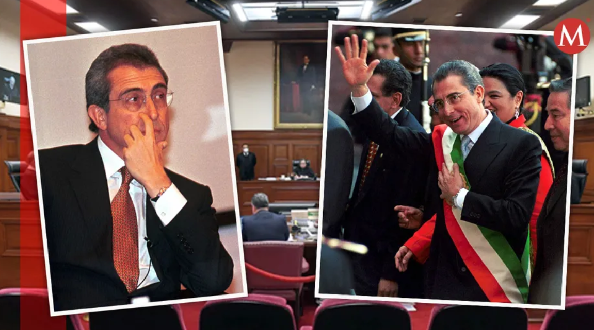
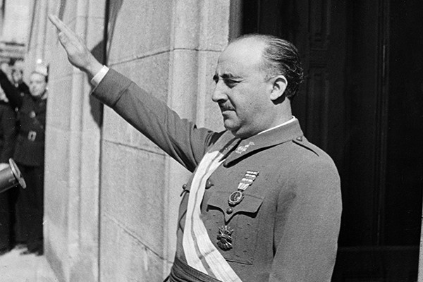

```{r globals, warning=FALSE, message=FALSE, error=FALSE}
source("utils/globals.R")
```

## Assessment

-   before starting writing, make sure to:

    -   read the Assessment page on the website extremely carefully

    -   read the FAQ page on the website

    -   consult the lecture slides on the research paper

## Assessment: write clearly {.smaller}

**What was the hypothesis in this paper?**

> South Africa is a noteworthy example of a country who created a constitutional court in order to successfully transition into democratization. This decision came at the cost of changing the jurisdictional scope and hierarchical standing of the Appellate division, now known as the Supreme Court of Appeal (SCA). This shift in the SCA’s jurisdictional scope and hierarchical standing allowed the Constitutional Court of South Africa (CC) to form a constitutional precedent, which I hypothesize increased the CC’s effectiveness and consequently contributed to South Africa’s successful transition into a democratic regime.

## Courts without democracy

-   most theories of courts assume a liberal democracy: elected politicians, an independent judiciary, a public that can punish

-   most of the world's courts operate without at least one of those

-   this week: why autocrats build courts, what those courts do and when they turn on their makers

-   and what this says about a literature written mostly about the US and Europe

# Why autocrats build courts

## What are courts for in an autocracy? {.smaller}

| function | what the ruler gets | examples |
|------------------------|----------------------------------|------------------------------------------|
| social control | dissent handled as law, not repression | Singapore's defamation suits |
| legitimation | power dressed as legality | post-Soviet constitutional courts |
| administrative discipline | courts watch local officials | China's administrative litigation [@cao2023suing] |
| credible commitment | investors trust property rights | Egypt [@moustafa2003law] |
| blame-shifting | judges take the blame | privatization, family law, religion |
| repressing rivals | trials discipline insiders | @shenbayh2018strategies |

-   each function needs a court that is somewhat believable [@ginsburg2008rule; @moustafa2014law]

## Insurance theory of court power

-   empowering courts comes at a cost to executives and legislators

-   courts are more stable than governments – empowering courts can **insure** incumbents against loss of power [@finkel2005judicial]

    -   powerful courts can make it harder to change policy direction

    -   they can also help protect former leaders and their assets

## 1994 judicial reform in Mexico

-   after winning elections in 1994 president Ernesto Zedillo decided to make the Mexican judiciary more independent and powerful – why?

-   @finkel2005judicial explains this counterintuitive move as a form of insurance policy

    -   the ruling Institutional Revolutionary Party was losing support and anticipated loss of power

    -   the reform gave the Mexican Supreme Court more power to circumscribe (federal and state) government policy

## 1994 judicial reform in Mexico

{width="600"}

## Independence by regime type

```{r vdemregime, warning=FALSE, message=FALSE}
vdemdata::vdem |>
  filter(year == max(year)) |>
  select(country_name, v2x_regime, v2juhcind_osp) |>
  drop_na() |>
  mutate(regime = factor(v2x_regime, levels = 0:3,
                         labels = c("closed autocracy", "electoral autocracy",
                                    "electoral democracy", "liberal democracy"))) |>
  ggplot(aes(x = regime, y = v2juhcind_osp)) +
  geom_boxplot(outlier.shape = NA) +
  geom_jitter(width = 0.15, alpha = 0.3) +
  geom_text(data = function(d) filter(d, country_name %in% c("Singapore", "United Arab Emirates", "Hungary", "Poland", "Venezuela", "United States of America")),
            aes(label = country_name), hjust = -0.1, size = 3) +
  theme_minimal() +
  labs(x = NULL, y = "High court independence (0-4)",
       title = "Judicial independence by regime type",
       subtitle = "V-Dem, latest year; Regimes of the World classification",
       caption = "Source: V-Dem via vdemdata")
```

## Judicial power in autocracies over time

```{r vdemautocracies}
vdemdata::plot_indicator("v2x_jucon",
                         min_year = 1970,
                         countries = c("Egypt", "China", "Russia", "Venezuela", "Hungary")) +
  theme_minimal() +
  theme(legend.position = "bottom") +
  scale_x_continuous() +
  labs(y = "Judicial Power",
       title = "Judicial constraints on the executive",
       subtitle = "V-Dem index 'judicial constraints on the executive'") +
  guides(linetype = "none")
```

# The dual state

## The dual state {.smaller}

-   Fraenkel, writing from inside Nazi Germany, described two states in one [@fraenkel2017dual]

    -   the **normative state**: ordinary law applied by ordinary courts to contracts, crimes and property

    -   the **prerogative state**: power acting without legal limits whenever it decides a matter is political

-   the boundary between the two is drawn by the regime, case by case, and the normative state keeps working precisely because the prerogative state exists

-   the concept travels: Francoist Spain, Russia [@hendley2022legal], China's environmental litigation that works until a state enterprise is the defendant [@stern2013environmental], Singapore's meticulous legality in the service of one-party rule [@rajah2012authoritarian]

-   for the study of courts it means that country-level independence scores average over two very different things

## Judicial independence in Francoist Spain

-   @toharia1975judicial documents that in the authoritarian Spain of the 1970s, judges held diverse opinions different from the regime

-   ordinary judges were by and large insulated from threat of removal or punishment by the government

-   however, the regime interfered with independence in politically sensitive cases by creating and staffing a host of special tribunals

## Judicial independence in Francoist Spain



## Legal dualism

-   @hendley2022legal argues that the creation of special tribunals for political issues is the exception in authoritarian regimes

    -   instead, the "normative" and "prerogative" states coexist side-by-side, often relying on informal institutions

    -   e.g. the same judge handling ordinary cases can be twisting the law to enable the persecution of dissidents

## China {.smaller}

-   the largest court system in the world, run by a party that has never pretended it stands outside the law it makes

-   **tying the autocrat's hands**: the party built commercial and property law, and courts to apply it, where it needed the cooperation of business elites it could not simply coerce [@wang2015tying]

-   **suing the government**: administrative litigation lets citizens challenge local officials; transferring such cases outside the local county raised the chance of the local government losing by about 4 percentage points [@cao2023suing]

-   **anti-corruption and court bias**: politically connected firms won more often in commercial disputes until the anti-corruption campaign after 2012 weakened the advantage [@zhang2023anticorruption]

-   courts work for the centre against local officials and connected firms, and stop where the centre's own power begins

## Rule by law in Singapore {.smaller}

-   Singapore has no show trials or special tribunals, and a judiciary ranked among the most efficient in the world

-   the same courts have bankrupted opposition politicians through defamation suits brought by ministers, upheld detention without trial and enforced the restrictions on assembly and speech [@rajah2012authoritarian]

-   **authoritarian rule of law**: legality as a source of legitimacy for a regime that never needs to break its own laws, because it writes them

-   by every procedural measure these courts are independent

# When courts bite

## When do courts in autocracies bite? {.smaller}

| condition | mechanism | evidence |
|----------------------|----------------------------------------|--------------------------------------|
| audiences | a bar, press or public backs the judges | Pakistan's lawyers [@ghias2010miscarriage; @kureshi2021when] |
| competition | rulers interfere when the opposition might win | Russia, Ukraine [@popova2010political]; election fraud [@harvey2022can] |
| fragmentation | divided rulers cannot punish judges | [@helmke2009regimes] |
| elections | electoral disputes give courts cover | Kenya 2017 [@gerzso2023judicial] |
| international audiences | investors, donors, accession talks | Turkey before 2010 |
| dual state | independence survives in the normative state only | Spain, Russia, China |

## Lawyers against the regime {.smaller}

-   Pakistan 2007: General Musharraf suspended Chief Justice Chaudhry; the bar went on strike, marched and boycotted the courts for two years, and the judges were restored in 2009 once Musharraf had gone [@ghias2010miscarriage]

-   the **legal complex**, lawyers and judges acting together, has carried political liberalism in more cases than the bench alone (Halliday, Karpik and Feeley 2007)

-   the same complex can be captured: bar associations packed, licences revoked, lawyers prosecuted, as in Turkey after 2016 and Belarus after 2020

-   audiences matter because a judge who rules against the regime needs someone to notice

## Elections and annulments {.smaller}

-   courts in competitive authoritarian and hybrid regimes are most exposed when they rule on elections, and that is also when they are most watched

-   Kenya 2017: the Supreme Court annulled the presidential election for irregularities, the first such annulment in Africa; the opposition boycotted the rerun and the president attacked the judges [@gerzso2023judicial]

-   Malawi 2020: the Constitutional Court annulled the 2019 presidential election over correction fluid on tally sheets, the Supreme Court upheld it, and the opposition won the rerun

-   in both cases the outcome depended on whether the government complied and how the opposition and voters responded

## Courts in the Global South {.smaller}

-   most research on courts comes from the US and Europe; most of the world's courts sit elsewhere, in states with legal pluralism, customary and religious courts, weak enforcement and personalist politics

-   independence and compliance mean something different when the ruling party is the state and the state barely reaches the village

-   research designs travel badly too, since cases are steered and dockets kept on paper

-   the field's map is being redrawn from South Africa, Colombia, India and Kenya outward [@riosfigueroa2025courts]

-   which findings about courts would you expect to hold in Lagos, Lahore or Lima?

## Can a court be independent in an undemocratic state?

## References
